# h1 Viisikko

## Koneen ympäristö

## Tehtävänanto

Kotitehtävät ovat tehty [terokarvinen.com/palvelinten-hallinta/#h1-viisikko](https://terokarvinen.com/palvelinten-hallinta/#h1-viisikko) mukaan

x) Lue ja tiivistä. (Tässä x-alakohdassa ei tarvitse tehdä testejä tietokoneella, vain lukeminen tai kuunteleminen ja tiivistelmä riittää. Tiivistämiseen riittää muutama ranskalainen viiva. Ei siis vaadita pitkää eikä essee-muotoista tiivistelmää. Lisää kuhunkin jokin oma kysymys tai huomio.)  

- Karvinen 2025: [Install Salt on Debian 13 Trixie](https://terokarvinen.com/install-salt-on-debian-13-trixie/)
- Karvinen 2023: [Run Salt Command Locally](https://terokarvinen.com/2021/salt-run-command-locally/)  
- Karvinen 2018: [Salt Quickstart – Salt Stack Master and Slave on Ubuntu Linux](https://terokarvinen.com/2018/03/28/salt-quickstart-salt-stack-master-and-slave-on-ubuntu-linux/)  
- Karvinen 2006: [Raportin kirjoittaminen](https://terokarvinen.com/2006/06/04/raportin-kirjoittaminen-4/)  

a) Asenna Debian 13-Trixie virtuaalikoneeseen. (Poikkeuksellisesti tätä alakohtaa ei tarvitse raportoida, jos siinä ei ole mitään ongelmia. Mutta jos on ongelmia, sitten täsmällinen raportti, jotta voidaan ratkoa niitä yhdessä.)  

b) Asenna Salt (salt-minion) Linuxille (uuteen virtuaalikoneeseesi).

c) Viisi tärkeintä. Näytä Linuxissa esimerkit viidestä tärkeimmästä Saltin tilafunktiosta: pkg, file, service, user, cmd. Analysoi ja selitä tulokset.

d) Idempotentti. Anna esimerkki idempotenssista. Aja 'salt-call --local' komentoja, analysoi tulokset, selitä miten idempotenssi ilmenee.

## x) Lue ja tiivistä

### Karvinen 2025: Install Salt on Debian 13 Trixie
- Salt on järjestelmänhallinta työkalu, jonka avulla voit määrittää infrastuktuurin koodina ja hallita suuren määrän Windows ja Linux koneita.
- Ohjelmaan varten tarvitset uuden kansion, koska se ei ole mukana Debianin vakiokansiossa. Uuden kansion lisääminen varmistaa että ohjelmisto on mahdollista päivittää automaattisesti.
- Uuteen kansio on vain kaksi tiedostoa: 'PGP public key' ja 'sources.list'.
- Ladatakseen tiedostot pitää ladata koneelle ensiksi 'wget'.
- Ladataan tiedostot virallisilta Salt-sivuilta.
- Käytetään julkista avainta luottamaan projektiin, jonka jälkeen ladataan ja asennetaan   ladataan Salt-ohjelma.
- Testataan ohjelma.

Nyt ohjelma on asennettu koneelle oikein.  

### Karvinen 2023: Run Salt Command Locally
- Voit ajaa Salt komennot paikallisesti ja nähdä tulokset välittömästi. Hyödyllistä harjoitukseen, testaamiseen ja nopeaan asentamiseen.
- Samat komennot toimivat niin Linuxissa kuin Windowsissa.
- Tärkeimmät tilafunktiot ovat pkg, file, service, user ja cmd.
- pkg.installed - komento, jolla pystytään asentamaan ja poistamaan ohjelmia.
- file.managed - komento, jolla pystytään lukemaan ja hallitsemaan tiedostoja (Linuxissa kaikki tiedostot tekstitiedostoja).
- service-running - komento, jota yleensä käytetään automaattisesti käynnistämään demoni kun asetuksia on muutettu.
- user.present - komento, jolla hallitaan käyttäjiä.
- cmd.run - annetaan komento.
- cmd.run pitää tehdä idempotentti, eli se toimii vain kun muutoksia pitää tehdä.
- Ohjeet saa komennolla 'sudo salt-call -- local sys.state_doc'

### Karvinen 2018: Salt Quickstart - Salt Stack Master and Slave on Ubuntu Linux
- Verkolla on yksi mestari ja yksi orja. Mestarin prompti on "master$" ja orjan "slave$".
- Jos mestarilla on palomuuri, pitää sille tehdä 4504/tcp ja 4506/tcp reiät muuriin.
- Jos palomuuria ei ole asennettu testiympäristöön, niin siitä ei tarvitse välittää.
- Orjan on tiedettävä missä mestari on.
- Orjalle voi antaa nimen (id) tai se saa sen automaattisesti hostnimeltä. Jokaisella orjalla pitää olla eri id.
- Uusien asetusten käyttöönotto ja orjan yhdistäminen mestariin tarvitsee demonin uudelleen käynnistyksen
- Mestarin täytyy hyväksyä "orja-avain".
- Kun testataan yhteyttä ja saadaan vastaus orjalta niin kaikki hyvin. Nyt voit luoda niin monta orjaa kuin haluat.

### Karvinen 2006: Raportin kirjoittaminen
- Raportoinnilla tarkoitetaan, että kerrotaan täsmällisesti mitä tehdään, ja mitä sitten tapahtui.
- Helpointa kirjoittaa samalla kun teet ja suoraan sähköiseen muotoon.
- Raportin pitää olla:
  - Toistettava - muiden pitää pystyä tekemään kaikki niin kuin raportissa lukee ja samat asiat pitää tapahtua.
    - Kerro ympäristö.
  - Täsmällinen - kerrotaan kaikki mitä komentoja on annettu tai mitä klikattu.
    - Kerrotaan kellonajat niin tiedetään paljon aikaa menee työvaiheissa.
    - Miten asiat onnistuivat tai tuliko virheitä.
  - Helppolukuinen - kirjoitetaan huolellisesti ja käytetään väliotsikoita.
  - Viittaa lähteisiin - Hyvät tavat ja akateeminen käytäntö vaatii.
  - Vältetään pahoja mokia esim. plagiointia tai kuvien luvatonta käyttöä.

## a) Debian 13-Trixien asennus virtuaalikoneelle

Debian 13-Trixien asennuksessa ei mitään ongelmia.

## b) Saltin asennus uudelle virtuaalikoneelleni

Tein Saltin asennuksen [Install Salt on Debian 13 Trixie](https://terokarvinen.com/install-salt-on-debian-13-trixie/) mukaan.  

Aloitan tehtävän tekemisen klo 17. Ensimmäiseksi päivitän listan saatavilla olevista paketeista 'sudo apt-get update'  
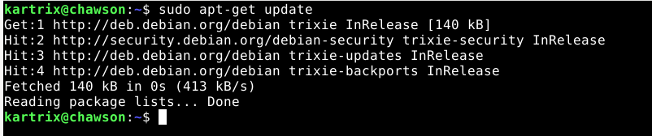  

Sitten asennan koneelle "wget"-ohjelman komennolla 'sudo apt-get install wget'. Wget pitää asentaa koneelle sen takia, jotta pystytään hakemaan saltin tarvitsema paketit URL-osoitteesta komentoriviltä. Se hakee sen tiedoston netistä ja asentaa sen paikallisesti.
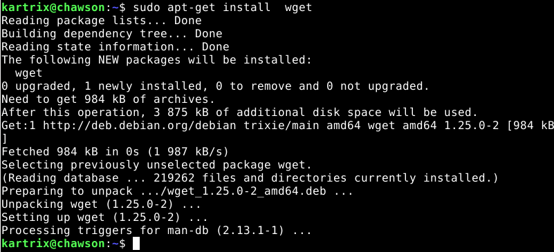  

Luodaan kansio saltia varten. Ladataan tarvittavat tiedostot wgetin avulla koneelle. Hankitaan siis julkinen avain ja sormen jälki, jolla näytetään että luotetaan ohjelmistoon.  
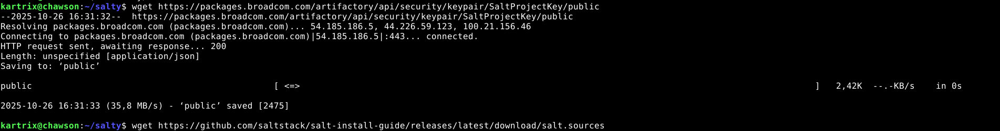  
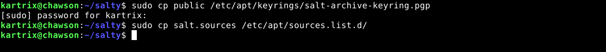  

Nyt kun saltin paketit on ladattu paikallisesti koneelle niin päivitettän saatavilla olevat paketit taas niin kuin heti alussa tehtiin. 'sudo apt-get update'  
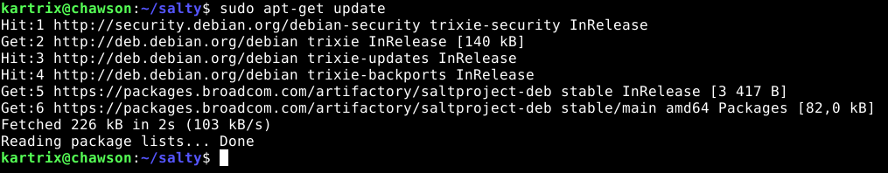  

Sitten asennetaan salt koneelle. Asennan samalla komennolla mestarin ja orjan. 'sudo apt-get install salt-minion salt-master'. Sen jälkeen tarkistan että salt on koneella ja mikä versio.  
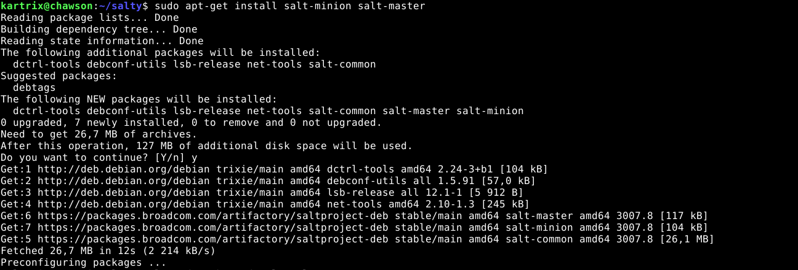  
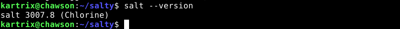  

Annetaan sille oikea komento ja katsotaan toimiiko se. 
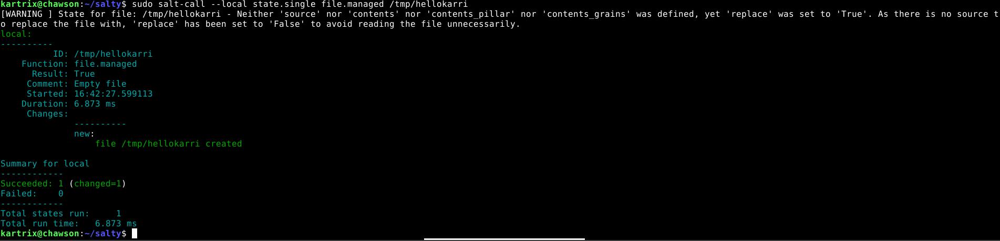  
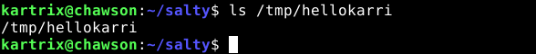  

Tehtävä valmis 17.25.  

## c) Saltin viisi tärkeintä tilafunktiota

Opettelin saltin tärkeimpiä tilafunktioita [Run Salt Command Locally](https://terokarvinen.com/2021/salt-run-command-locally/) mukaan.  

Ensimmäisenä kokeillaan pkg (package) komentoa. Sillä voidaan asentaa ja poistaa ohjelmia saltin kautta. Asensin 'cowsay'-ohjelman sillä ja testasin sitten toimiiko asentamani ohjelma.  
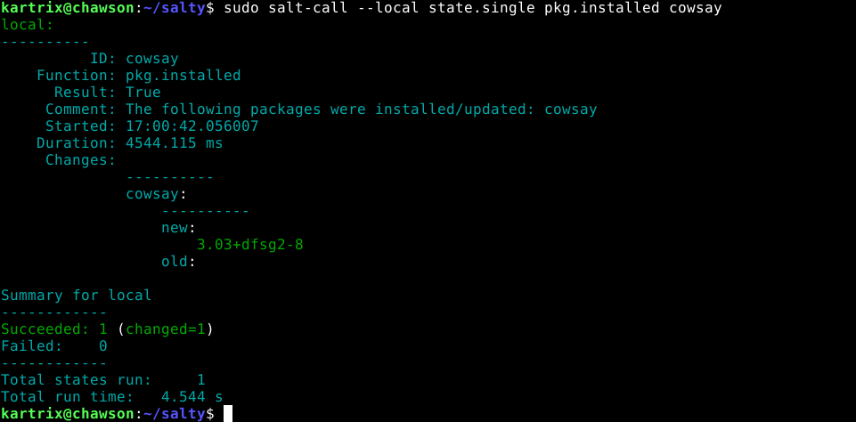  
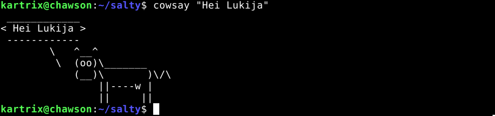  

Kaikki meni hyvin.  

Seuraavaksi sitten kokeillaan file-tilafunktioa. Sitä tuli jo kokeiltua edellisessä tehtävässä kun loin "hellokarri" tiedoston. Lisätään sinne nyt teksti "Hei Karri!" käyttämällä saltin file-tilafunktiota.  
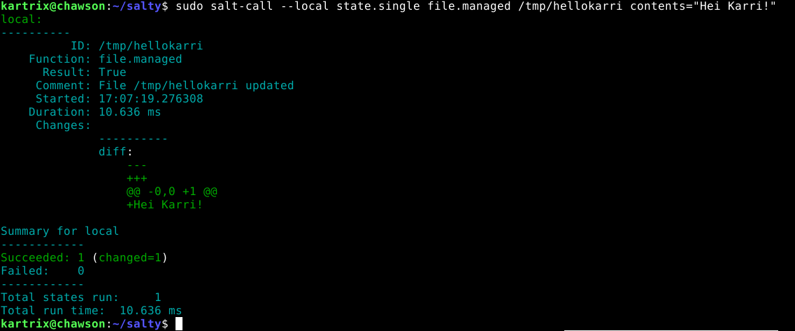  
  
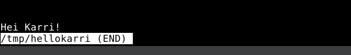  

Seuraavaksi kokeillaan potkaista demoni käyntiin saltin service-tilafunktiolla. Potkaisen apache2, mutta koska en ole sitä vielä asentanu koneelle niin se ei pysty käynnistymään.  
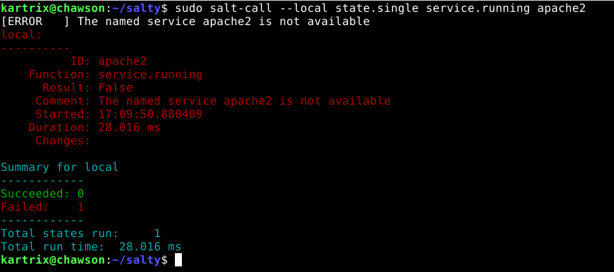  

Sitten vuorossa on user. Tällä pystytään hallitsemaan koneen käyttäjiä. Luon käyttäjän kartsa ja sitten poistan sen.  
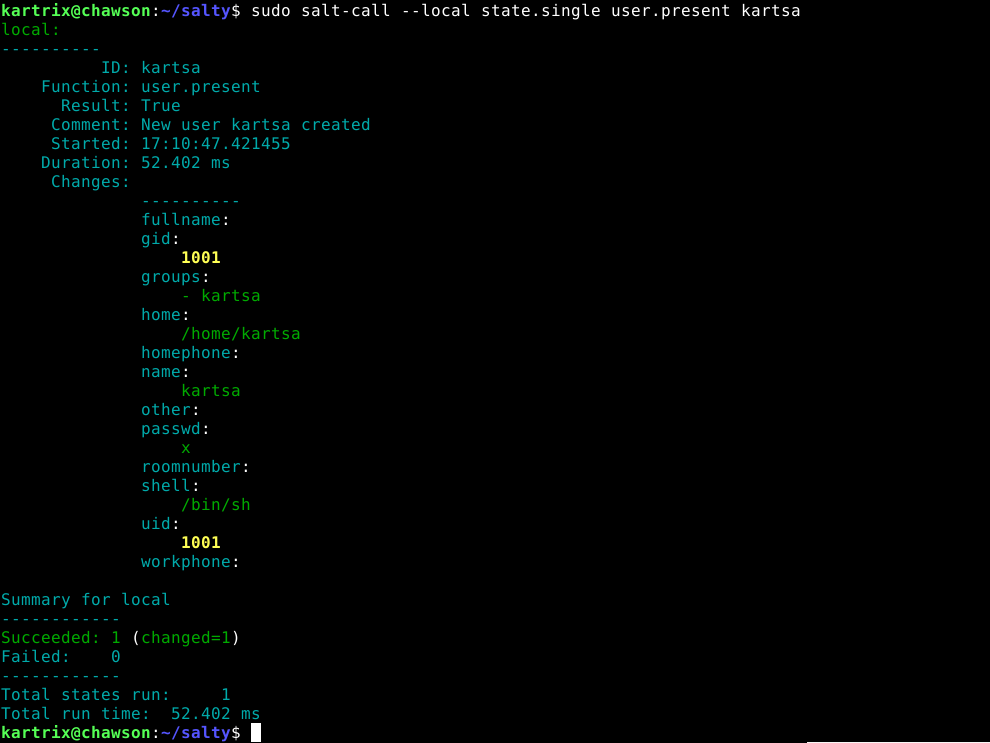  
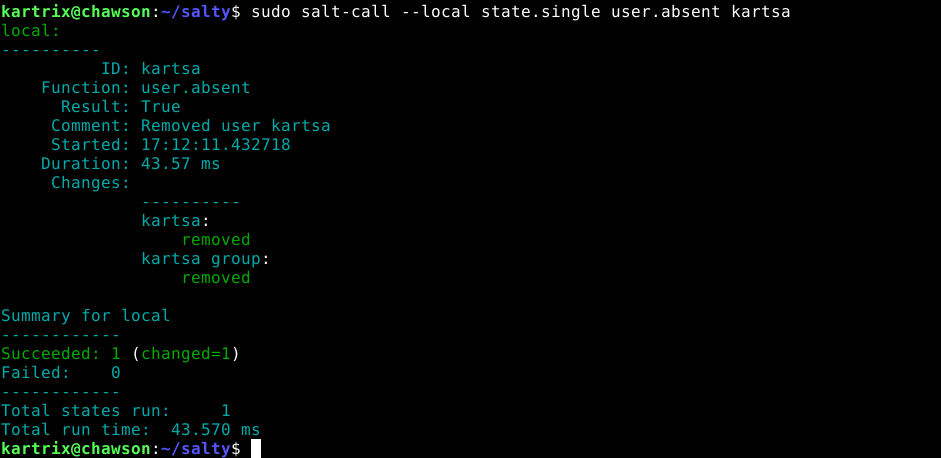  

Viimeisenä kokeilen cmd.run. Tätä käytettäessä on tärkeää muistaa laittaa lisäfunktiota kuten esim. 'creates', jotta komennosta tulee idempotentti. Muuten saattaa käydä niin että tätä komentoa käytettäessä kirjoittaa tärkeiden asioiden päälle. Luodaan tiedosto 'foo'.
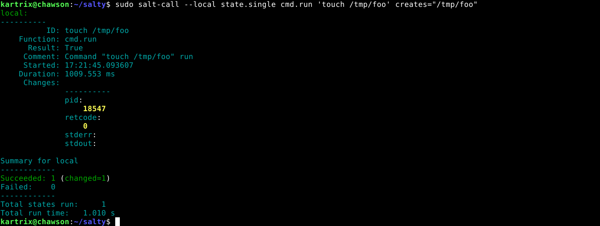  

## d) idempotentti

Kokeillaan eri komentoja ja katsotaan onko ne idempotentteja. Idempotentilla tarkoitetaan yksinkertaisesti sitä että, jos esim tiedosto tai ohjelma on jo koneella niin salt ei tee sitä uudestaan. Näin ollen ei tule vahingossa kirjoitettua tärkeiden tietojen päälle ja hävitettyä dataa mitä on vaikea tai jopa mahdotonta saada takaisin.  

Ensimmäisenä kokeilen file. Koska aikasemmin lisäsiin "hellokarri" tekstin "Hei Karri!" niin kun annan saman komennon uudestaan niin salt ei päivitä tiedostoa vaan sanoo että se on oikealla mallilla.  
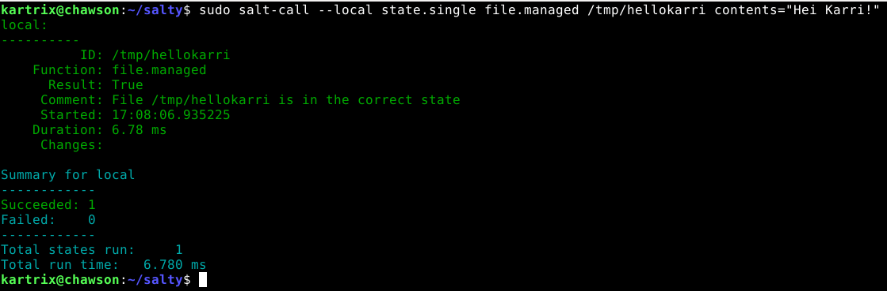  

Kokeillaan vielä uudestaan cmd.run ja yritetään luoda uudestaan tiedosto foo. Koska käytän komennossa 'creates' -tilaa niin salt ei luo uutta foo-tiedostoa tai kirjoita vanhan päälle.  
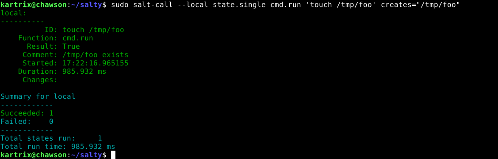  

## Lähteet:

Karvinen, Tero. 2025. Palvelinten hallinta. https://terokarvinen.com/palvelinten-hallinta/#h1-viisikko  
Karvinen, Tero. 2025. Install Salt on Debian 13 Trixie. https://terokarvinen.com/install-salt-on-debian-13-trixie/      
Karvinen, Tero. 2006. Raportin kirjoittaminen. https://terokarvinen.com/2006/06/04/raportin-kirjoittaminen-4/  
Karvinen, Tero. 2023. Run Salt Command Locally. https://terokarvinen.com/2021/salt-run-command-locally/    
Karvinen, Tero. 2018. Salt Quickstart – Salt Stack Master and Slave on Ubuntu Linux. https://terokarvinen.com/2018/03/28/salt-quickstart-salt-stack-master-and-slave-on-ubuntu-linux/  
