# h2 Infraa Koodina

## Koneen ympäristö

## Tehtävänanto
Kotitehtävät tehty [terokarvinen.com/palvelinten-hallinta/#h2-infraa-koodina](https://terokarvinen.com/palvelinten-hallinta/#h2-infraa-koodina) mukaan.

x) Lue ja tiivistä. (Tässä x-alakohdassa ei tarvitse tehdä testejä tietokoneella, vain lukeminen tai kuunteleminen ja tiivistelmä riittää. Tiivistämiseen riittää muutama ranskalainen viiva.)

- Karvinen 2014: Hello Salt Infra-as-Code
- Salt contributors: Salt overview, kohdat
  - Rules of YAML
  - YAML simple structure
  - Lists and dictionaries - YAML block structures
- Salt contributors: The top file, kohdat
  - Introduction
  - A basic example

a) Hei infrakoodi! Kokeile paikallisesti (esim 'sudo salt-call --local') infraa koodina. Kirjota sls-tiedosto, joka tekee esimerkkitiedoston /tmp/ -kansioon.

b) Toppping. Tee top-file, niin että kaikki omat tilasi ajetaan kerralla komennolla 'sudo salt-call --local state.apply'.

c) Viisikko tiedostossa. Tee erilliset esimerkit kustakin viidestä tärkeimmästä tilafunktiosta pkg, file, service, user, cmd. Kirjoita esimerkit omiksi tiloikseen /srv/salt/ alle, esim /srv/salt/hellopkg/init.sls.

d) Tee sls-tiedosto, joka käyttää vähintään kahta eri tilafunktiota näistä: package, file, service, user. Tarkista eri ohjelmalla, että lopputulos on oikea. Osoita useammalla ajolla, että sls-tiedostosi on idempotentti.

## x) Lue ja tiivistä

### Karvinen 2014: Hello Salt Infra-as-Code
- Pitää luoda kansio salt-kansioon, jonne infrakoodi tehdään. Tässä esimerkissa luodaan hello-kansio.
- Mene luomaasi kansioon ja luo sinne inti.sls-tiedosto. Kirjoitetaan idempotentti infrakoodi. /tmp/hellotero: file.managed
- Ajetaan koodi komennolla 'sudo salt-call --local state.apply hello'. Saadaan tarkka raportti mitä tapahtuu ja tiedosto /tmp/hellotero on luotu.
- Ajetaan koodi uudestaan niin nähdään onko koodi idempotentti. Idempotentti koodi ei luo uutta /tmp/hellotero tiedostoa.

### Salt contributors: Salt overview
- Rules of YAML:
  - YAML on merkintäkieli, jossa on monia tehokkaita ominaisuuksia. YAML renderöijän tehtävä on ottaa YAML datarakennelma ja kääntää se Python datarakenteeksi Saltia varten.
  - Data jäsennetään avain-arvo-pareina
  - Määrityksessä käytetään kaksoispistettä ja välilyöntiä (": ") merkitsemään avain-arvo-parit
  - Arvot voivat olla monenlaisissa rakenteissa.
  - Pitää käyttää välilyöntejä, ei sarkaimia.
  - Kommentit alkaa #-merkilä

- YAML simple structure
  - YAML koostuu kolmesta peruselementtityypistä:
    - Scalar: avain-arvo-määritykset, joissa arvo voi olla numero, merkkijono tai totuusarvo (boolean)
    - Lists: avain, jonka jälkeen tulee arvolista. Jokainen arvo on omalla rivillään ja sitä edeltää kaksi välilyöntiä sekä tavuviivaa.
    - Dictionaries: kokoelma avain-arvo-määrityksiä ja listoja.

- Lists and dictionaries - YAML block structures
  - YAML on jäsennelty lohkorakenteiksi
  - Sisennys määrittää rakenteen kontekstin
  - Ominaisuudet ja listat täytyy sisentää yhdellä tai useammalla välilyönnillä. Kahden välilyönnin käyttö on yleinen standardi
  - Kokoelma, eli lista tai dictionary -lohko, ilmaisee jokaisen alkionsa tavuviivalla ja välilyönnillä ("- ").

### Salt contributors: The Top file
  - Introduction
    - Infrastruktuurit koostuvat useista koneryhmistä, joilla on omat roolinsa.
    - Koneet, joilla on samankaltainen tehtävä, muodostavat roolipohjaisia ryhmiä.
    - Saltissa koneryhmien ja roolien välinen yhteys määritellään top-tiedostossa
    - Top-tiedoston oletusnimi: top.sls.
    - Top-tiedostot sijaistevat hakemistorakenteen ylimmällä tasolla, jota kutsutaan tilapuuksi (state tree).
   
  - A Basic Example
    - Top-tiedostossa on kolme pääosaa: ympäristö, kohde ja tilatiedostot.
    - Ympäristö = hakemisto, jossa on tilatiedostoja konfigurointia varten.
    - Kohde = konejoukko, joihin tietyt tilat sovelletaan.
    - Tilatiedostot = kuvaavat, mitä konfiguraatioita kohdekoneisiin asetetaan.
    - Rakenne on hierarkinen: ympäristö -> kohteet -> tilat.

## a) Hei Infrakoodi!  

Menin salt-kansioon ja loin sinne kansion hello. Sitten micron-tekstieditorin avulla loin init.sls-tiedoston sinne. Tiedoston sisään laitoin koodin: '/tmp/hei_infrakoodi: file.managed'  

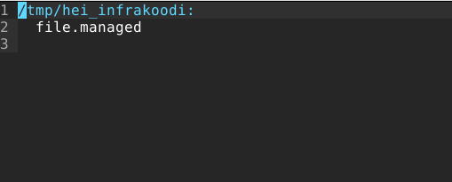  

Sitten ajoin tiedoston paikallisesti saltilla komennolla 'sudo salt-call --local state.apply hello'. Ajo onnistui ja salt loi uuden tiedoston.  

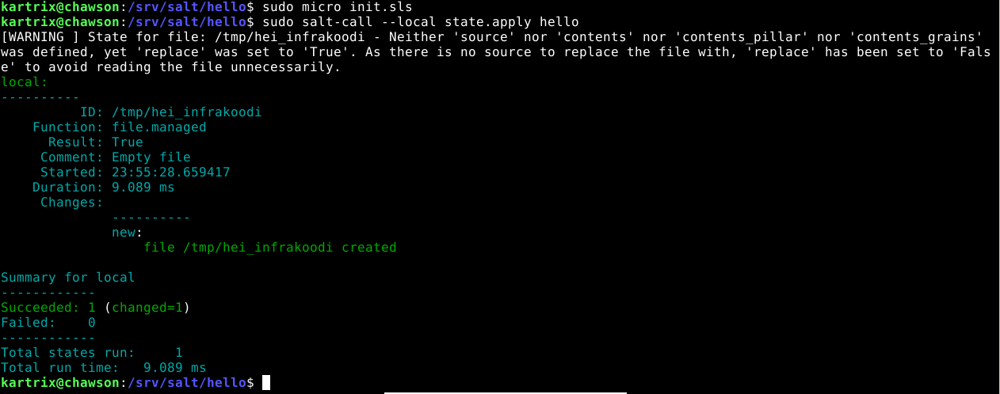  

## b) Toppping

Mennään salt-kansioon ja luodaan sinne top.sls-tiedosto.  'sudo micro top.sls'. Ympäristö (env) base:. Sen alle kaikki orjat '*' ja lista tiloista mitä ajetaan. Nyt vain yksi, jonka tein edellisessä tehtävässä.  

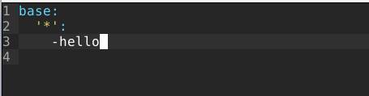  

Ajetaan top.sls-tiedosto komennolla 'sudo salt-call --local state.apply'. Ja näyttäisi siltä että ajo onnistui. Mutta tosin tiedosto on jo luotu niin salt ei luo uutta.  

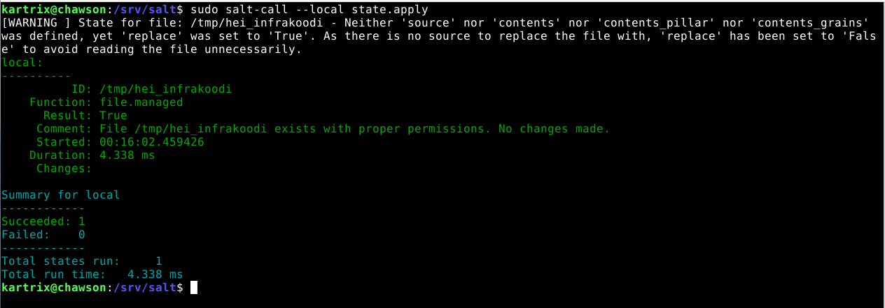  

## c) Viisikko tiedostossa

Luodaan kaikille tehtävän tilafunktiolle omat kansionsa. Sitten tehdään kaikille omat init.sls-tiedostot  

pkg  
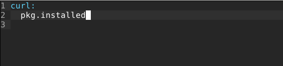  

file  
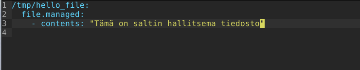

service  
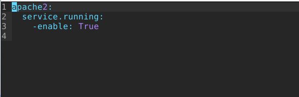  

user  
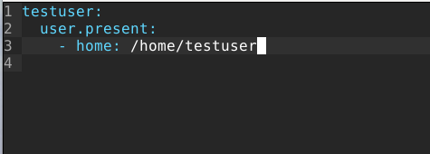  

cmd  
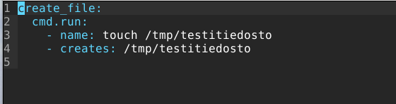  

## d) Tee sls-tiedosto

Tehdään sls-tiedosto, joka ajaa kaksi eri tilamuuttujaa. Luodaan uusi kansio 'pkguser'. Tilamuuttujani ovat pkg ja user.  

Luodaan init.sls-tiedosto kansioon.  

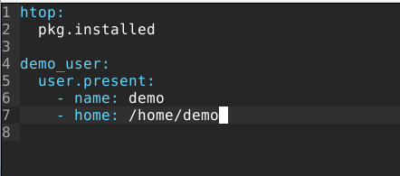  

Ajetaan tiedosto.

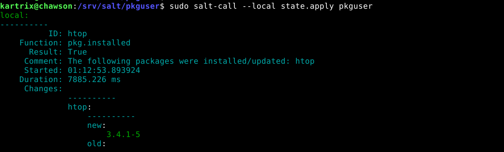  
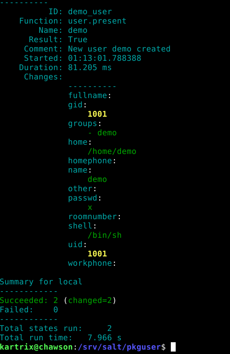  

Testataan onko tiedosto idempotentti. Ajetaan tiedosto pariin otteeseen ja näyttäisi siltä että se on idempotentti.

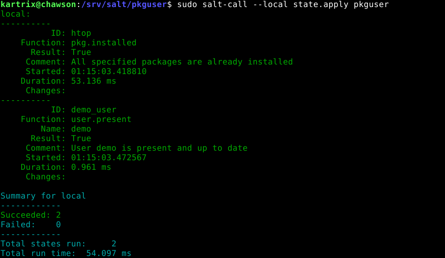  
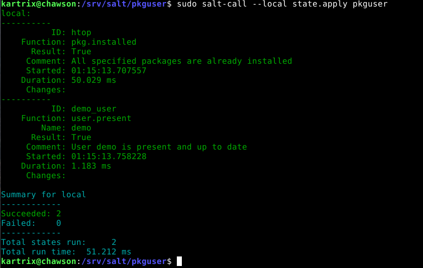  

## Lähteet:

Karvinen, Tero. 2014. Hello Salt Infra-as-Code. https://terokarvinen.com/2024/hello-salt-infra-as-code/  
Salt Contributors. 2025. Salt overview. https://docs.saltproject.io/salt/user-guide/en/latest/topics/overview.html#rules-of-yaml  
Salt Contributors. 2025. The Top File. https://docs.saltproject.io/en/latest/ref/states/top.html  

