# h3 Soitto kotiin

## Tehtävänanto

Kaikki tehtävät on tehty [h3 Soitto kotiin](https://terokarvinen.com/palvelinten-hallinta/#h3-soitto-kotiin) mukaan.  

x) Lue ja tiivistä
- Karvinen 2021: [Two Machine Virtual Network With Debian 11 Bullseye and Vagrant](https://terokarvinen.com/2021/two-machine-virtual-network-with-debian-11-bullseye-and-vagrant/)
- Karvinen 2018: [Salt Quickstart - Salt Stack Master and Slave on Ubuntu Linux](https://terokarvinen.com/2018/salt-quickstart-salt-stack-master-and-slave-on-ubuntu-linux/?fromSearch=salt%20quickstart%20salt%20stack%20master%20and%20slave%20on%20ubuntu%20linux)
- Karvinen 2023: [Salt Vagrant - automatically provision one master and two slaves](https://terokarvinen.com/2023/salt-vagrant/#infra-as-code---your-wishes-as-a-text-file)
  - Infra as Code - Your wishes as a text file
  - top.sls - What Slave Runs What States
 
a) Hello Vagrant! Osoita jollain komennolla, että Vagrant on asennettu (esim tulostaa vagrantin versionumeron). Jos et ole vielä asentanut niitä, raportoi myös Vagrant ja VirtualBox asennukset. (Jos Vagrant ja VirtualBox on jo asennettu, niiden asennusta ei tarvitse tehdä eikä raportoida uudelleen.)  
b) Linux Vagrant. Tee Vagrantilla uusi Linux-virtuaalikone.  
c) Kaksin kaunihimpi. Tee kahden Linux-tietokoneen verkko Vagrantilla. Osoita, että koneet voivat pingata toisiaan.  
d) Herra-orja verkossa. Demonstroi Salt herra-orja arkkitehtuurin toimintaa kahden Linux-koneen verkossa, jonka teit Vagrantilla. Asenna toiselle koneelle salt-master, toiselle salt-minion. Laita orjan /etc/salt/minion -tiedostoon masterin osoite. Hyväksy avain ja osoita, että herra voi komentaa orjakonetta.
e) Kokeile vähintään kahta tilaa verkon yli (viisikosta: pkg, file, service, user, cmd)  

## Lue ja Tiivistä

### Two Machine Virtual Network With Debian 11 Bullseye and Vagrant
- Ohje kahden Debian-virtuaalikoneen verkon luomiseen Vagrantilla ja Virtualboxilla.
- Vagrant automatisoi virtuaalikoneiden luonnin ja SSH-kirjautumisen ilman graafista käyttöliittymää.
- 'Vagrantfile' määrittelee kahden koneen asetukset, IP-osoitteet ja asennettavat paketit.
- Koneet voidaan käynnistää komennolla 'vagrant up' ja niihin kirjaudutaan 'vagrant ssh 001'.
- Molemmat koneet voivat pingata toisiaan ja Internetiä.
- Ympäristön voi helposti tuhota ja luoda uudelleen.
- Jos IP-osoitteet eivät toimi, vaihda ne sallittuun osoitealueeseen

### Salt Quickstart - Salt Stack Master and Slave on Ubuntu Linux
- Yksi master hallitsee yhtä tai useampaa orjaa.
- Jos mestarilla on palomuuri, pitää sille tehdä 4504/tcp ja 4506/tcp reiät muuriin.
- Jos palomuuria ei ole asennettu testiympäristöön, niin siitä ei tarvitse välittää.
- Orjan on tiedettävä missä mestari on.
- Orjalle voi antaa nimen (id) tai se saa sen automaattisesti hostnimeltä. Jokaisella orjalla pitää olla eri id.
- Uusien asetusten käyttöönotto ja orjan yhdistäminen mestariin tarvitsee demonin uudelleen käynnistyksen
- Mestarin täytyy hyväksyä "orja-avain".
- Kun testataan yhteyttä ja saadaan vastaus orjalta niin kaikki hyvin. Nyt voit luoda niin monta orjaa kuin haluat.

### Salt Vagrant - automatically provision one master and two slaves
- Infra as Code - palvelinympäristö kuvataan tekstitiedostoilla, jolloin sen voi pystyttää automaattisesti ja toistettavasti.
- Vagrant ja Salt yhdistettynä mahdollistavat koko ympärostön (master + slaves) luomisen yhdellä komennolla.
- top.sls määrittää, mitkä tilat (states) suoritetaan millä koneilla ja tällä tavalla koko insrastruktuuri voidaan hallita keskitetysti ja toistettavasti koodin avulla.

## a) Vagrantin asennus

Aika ladata ja asentaa Vagrant. Menen osoitteeseen https://developer.hashicorp.com/vagrant/downloads ja valitsen sieltä Windows AMD64 -tiedoston. Aloitan asennuksen. Asennus-ikkunassa painan 'install' ja asennus kestää pari minuuttia. Lopuksi painan 'finish' ja tulee pyyntö käynnistää kone uudelleen ja teen niin.  

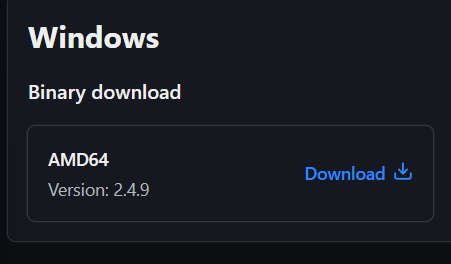  
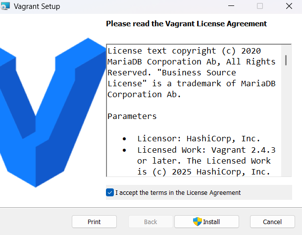  
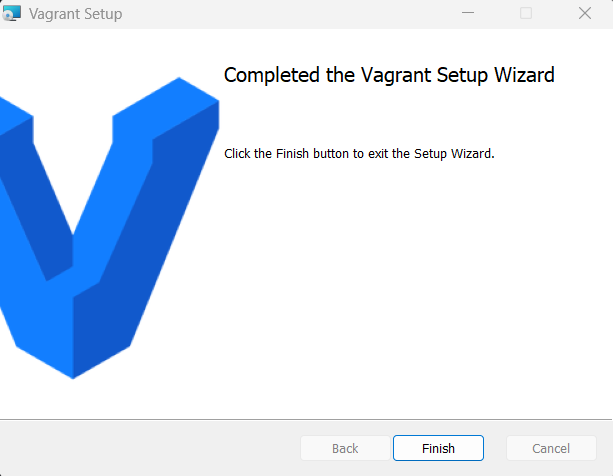  

Todistetaan että Vagrant on asennettu onnistuneesti. Menen CMD ja annan komennon vagrant --version. Asennus onnistui, Vagrant versio on 2.4.9.  

## b) Linux Vagrant

Luodaan Vagrantilla uusi linux virtuaalikone. Cmd:ssä luon uuden kansion 'Vagrant-test' ja ajan siellä komennon 'vagrant init debian/bookworm64' luodakseni uuden vagrant-projektin.  

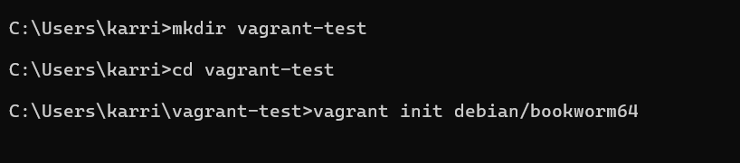  

Katson nopeasti mitä vagrantfile sisältää. Paljon tekstiä siitä kuinka vagrantin konfigurointi onnistuu.  

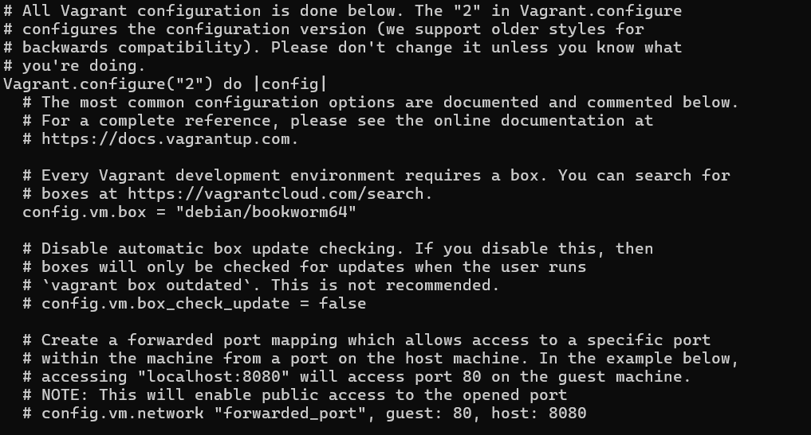  

Käynnistetään virtuaalikone komennolla 'vagrant up'.  

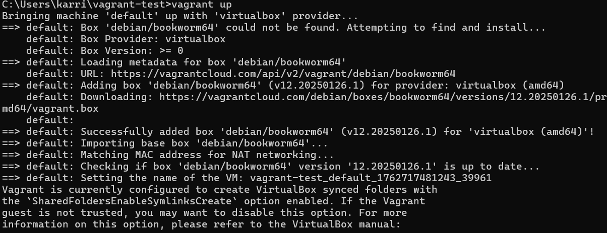  

Yhdistetään virtuaalikoneeseen. 'vagrant ssh', ja sitten tarkistan onko kyseessä debian 12. 'cat os-release'. Kaikki näyttäisi olevan hyvin.  

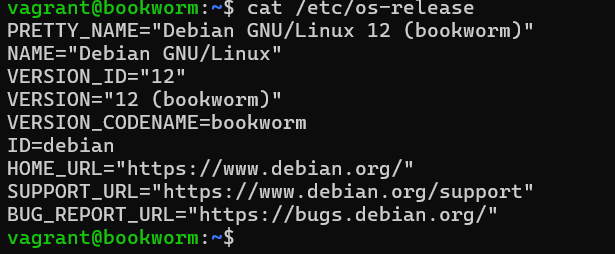

kirjaudun ulos virtuaalikoneesta.  

Uuden debian 12 -virtuaalikoneen luominen Vagrantilla onnistui ja käyttöjärjestelmäversio varmistettu.

## Kaksin kaunihimpi

Luodaan toinen vagrant-virtuaalikone ja tehdään molempien koneiden välille toimiva verkko.  

Muokataan vagrantfile tiedostoa ja luodaan sitä kautta orja-kone.  

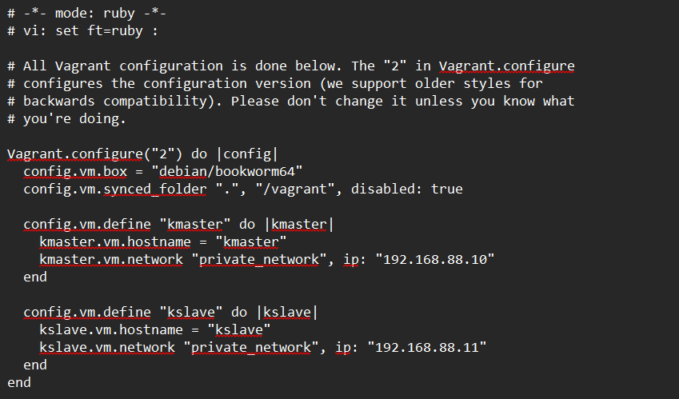  

Käynnistetään vagrant uudestaan. VirtualBox kyselee lupia tehdä muutoskia. Luotetaan. Jahas virheilmoitus. Sanoo ettei voi luoda host-only adapteria eikä löydä host interface networking driveria. Yritetään selvittää mikä on homman nimi.  

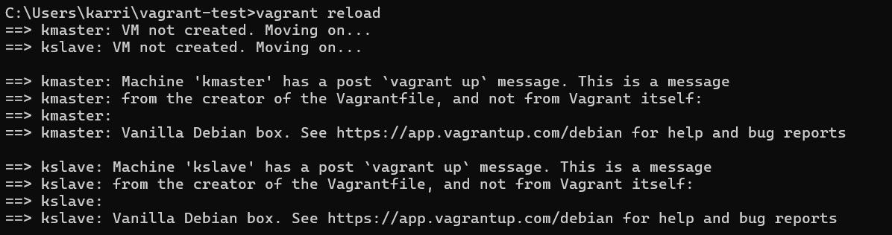  
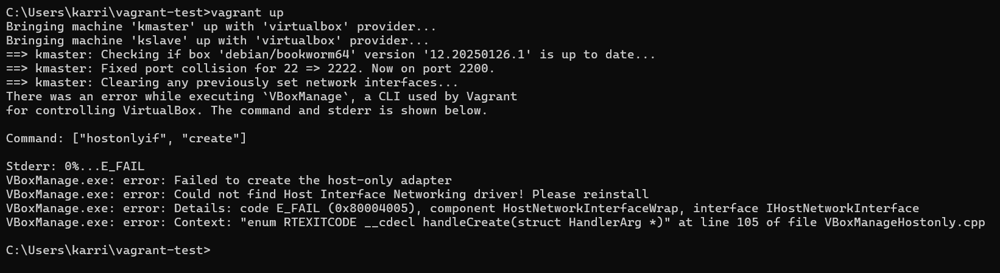  

Pienen googlettelun jälkeen kokeilen ajaa vagrant up cmd:ssa admin tilassa. Ei toimi. Seuraava vaihe on VirtualBoxin poisto ja uuden version asennus.  

Uusi versio asennettu ja siellä näkyi että host-only networking asennetaan. Käyn tarkistamassa virtual boxin asennuksista jos siellä näkyisi jotain. VirtualBox -> File -> Tools -> Network (sinne pääsee myös komennolla ctrl + H). Siellä löytyy nyt VirtualBox Host-Only Ethernet Adapter #2. IP ei osu kohdilleen. Muutan Vagrantfilessa koneiden IP:t adapteriin sopiviksi. Toivotaan nyt että homma toimii.  

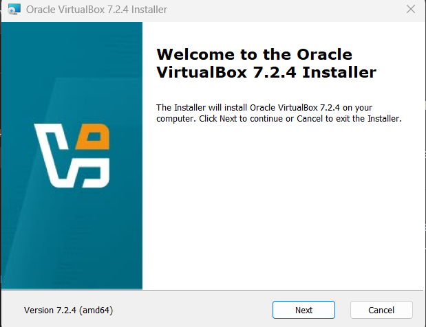  
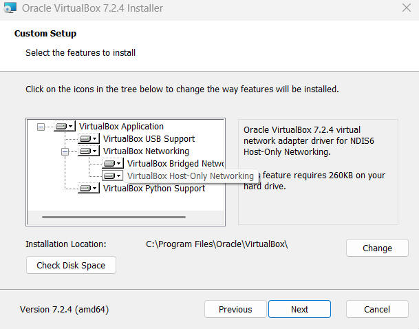  
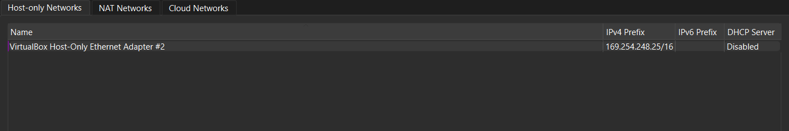  
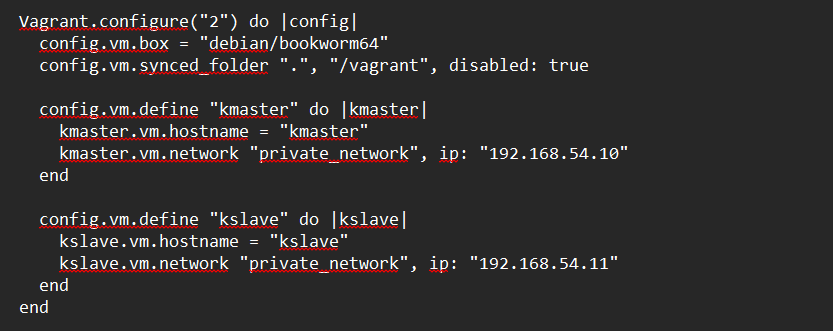  

Ajetaan cmd:ssa vagrant up jälleen. ja homma skulaa! Sitten on pingauksen aika. Se onnistuu molempiin suuntiin!

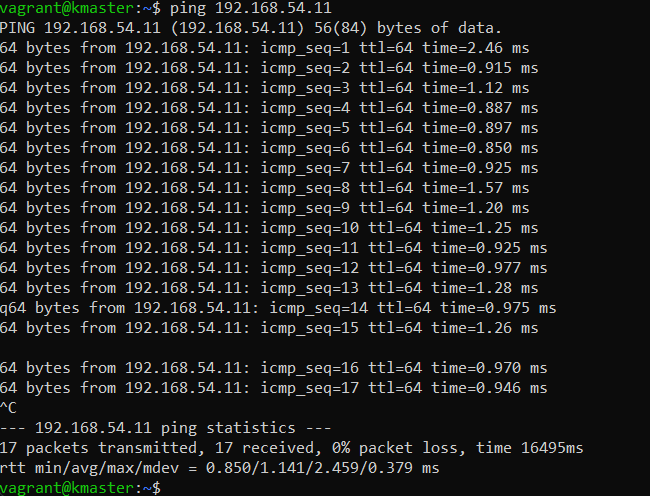  
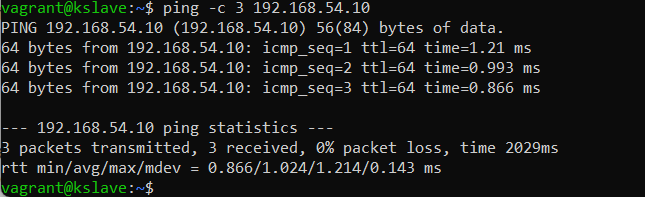  

## Herra-orja verkossa

Tehdään salt asennust tämän https://docs.saltproject.io/salt/install-guide/en/latest/topics/install-by-operating-system/linux-deb.html ohjeen mukaan.

Asennetaan Salt Vagrant virtuaalikoneisiin. Ensiksi master. Ensiksi pakettien päivitys. Sitten salt asennus. Masterille asennus onnistui. Sama homma minionille. Onnistui asennus. Sitten laitetaan minionin salt-tiedostoon masterin IP-osoite niin se tietää kuka käskyttää. Lopuksi käydään hyväksymässä minionin avain masterin puolella. Vielä testi pingaus niin tiedetään että kaikki ok. Kaikki OK!

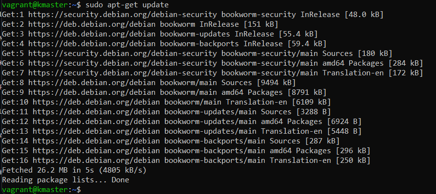  
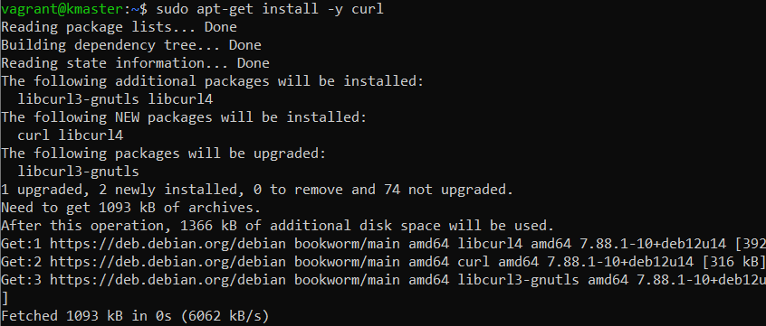  
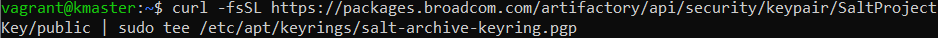  
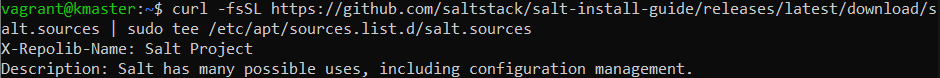  
  
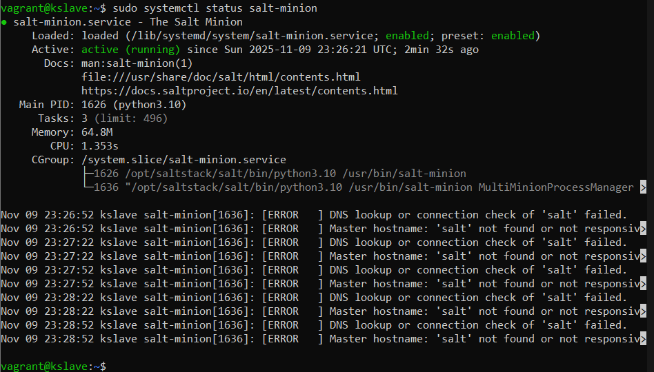  
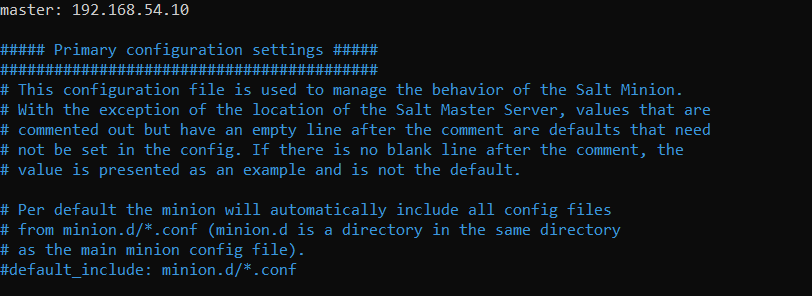  
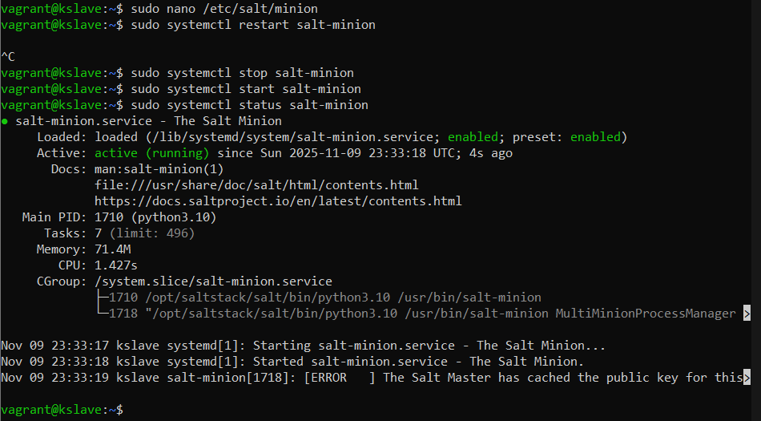  
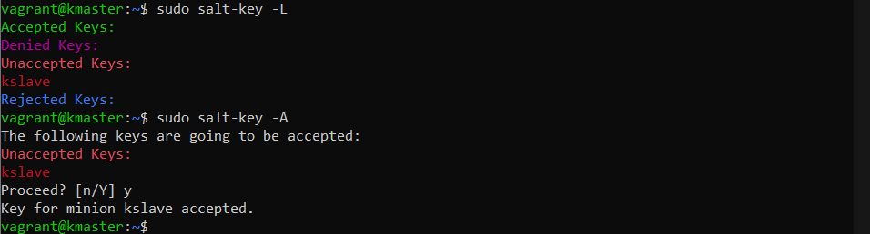  
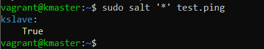  

## Tilat verkon yli

Kokeillaan toimiiko masterilla verkon yli ajot. Luon hakemiston tiloille. Sitten teen pkgtest.sls ja filetest.sls -tiedostot sinne ja laitan koodia. Sitten kutonen silmään ja ajoa.

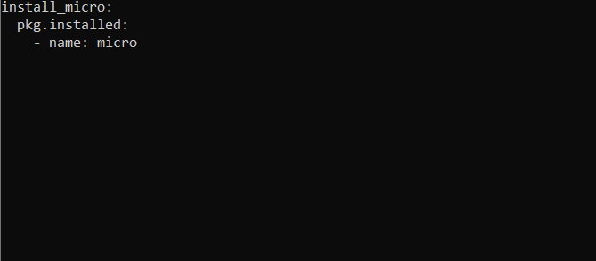  
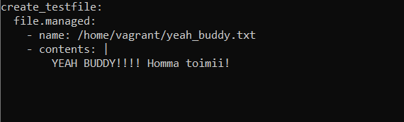  

Molemmat testit onnistuvat ja koodi on idempotenttia.

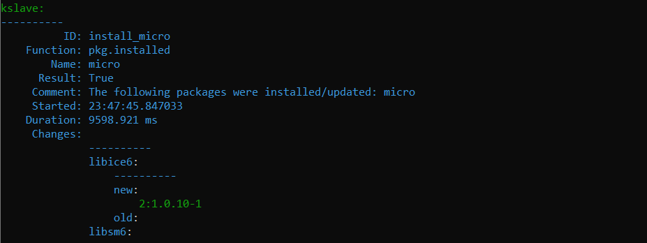  
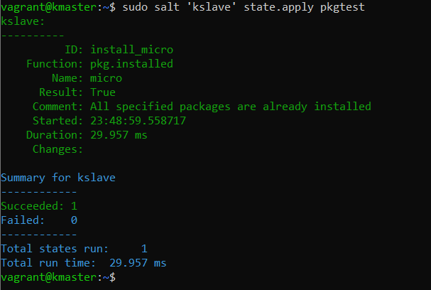  
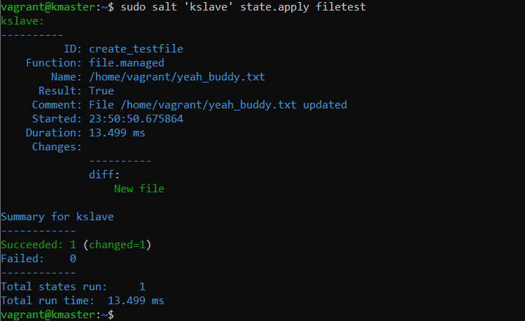  
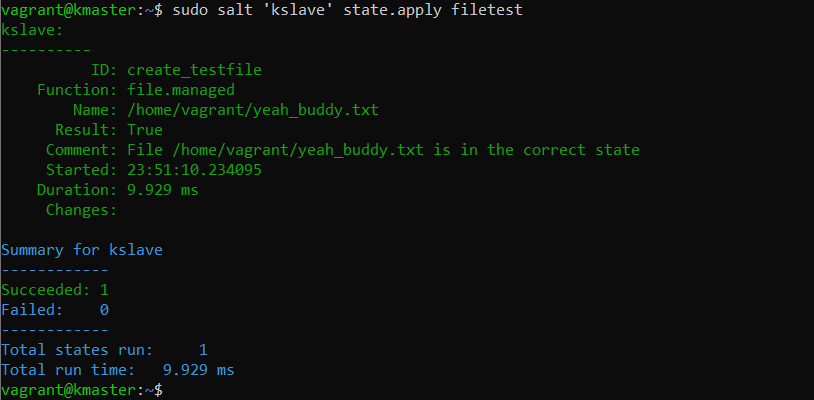  

## Lähteet:

Virtualbox.org. 2018. https://forums.virtualbox.org/viewtopic.php?t=86179  
Salminen, Antti. 2020. h6. https://oispadotka.wordpress.com/2020/05/12/h6/  
Karvinen, Tero. https://terokarvinen.com/2021/two-machine-virtual-network-with-debian-11-bullseye-and-vagrant/  
Karvinen, Tero. https://terokarvinen.com/2018/salt-quickstart-salt-stack-master-and-slave-on-ubuntu-linux/?fromSearch=salt%20quickstart%20salt%20stack%20master%20and%20slave%20on%20ubuntu%20linux  
Karvinen, Tero. https://terokarvinen.com/2023/salt-vagrant/  
https://www.howtoforge.com/how-to-install-saltstack-on-debian-12/  
https://docs.saltproject.io/salt/install-guide/en/latest/topics/install-by-operating-system/linux-deb.html  
https://www.virtualbox.org/manual/ch06.html  
https://forums.virtualbox.org/viewtopic.php?t=94277  
https://stackoverflow.com/questions/53258212/failed-to-create-the-host-only-adapter  

