# h4 Pkg-file-service

## Tehtävänanto
Tehtävät tehdään https://terokarvinen.com/palvelinten-hallinta/ mukaan

- x) Lue ja tiivistä. (Tässä x-alakohdassa ei tarvitse tehdä testejä tietokoneella, vain lukeminen tai kuunteleminen ja tiivistelmä riittää. Tiivistämiseen riittää muutama ranskalainen viiva.)
 - Karvinen 2018: Pkg-File-Service – Control Daemons with Salt – Change SSH Server Port
   - Artikkelissa on esimerkkinä jonkun toisen Linux-version sshd_config tiedosto. Jos tekisit samanlaisen, niin käyttäisit tietysti oman järjestelmäsi asetustiedostoa pohjana.
   - Nykyisin suosittelen asentamaan jokaisen modulin omaan kansioonsa, eli /srv/salt/ssh/init.sls (eikä hujan hajan /srv/salt/ssh.sls)

- a) SSHouto. Lisää uusi portti, jossa SSHd kuuntelee.
  - Jos käytät Vagrantia, muista jättää portti 22/tcp auki - se on oma yhteytesi koneeseen. SSHd:n asetustiedostoon voi tehdä yksinkertaisesti kaksi "Port" riviä, molemmat portit avataan.
  - Löydät oikean asetuksen katsomalla SSH:n asetustiedostoa
  - Nyt tarvitaan service-watch, jotta demoni käynnistetään uudelleen, jos asetustiedosto muuttuu masterilla
  - Ensin käsin: muista näyttää, että ensin teit ja testasit muutoksen käsin.
  - Näytä, että tilasi korjaa puutteet. Voit esimerkiksi poistaa paketin tai tehdä virheen tiedostoon käsin, sitten ajaa tilasi.

## Lue ja tiivistiä

### Pkg-File-Service - Control Daemons with Salt - Change SSH Server Port
- Artikkelissa käytetään Salt States -mallia: pkg -> file -> service
- Ensiksi paketin asennus (pkg.installes), sitten asetustiedostoa hallitaan Saltilla (file.managed) ja lopuksi palvelu käynnistetään tai restartataan jos asetukset muuttuvat (service.running + watvh).

## SSHOuto

Eli jos ymmärsin oikein niin aukko pitää tehdä kätyrille. Joten ihan ensiksi kirjaudun kärytille windowsin cmd:ssa. 'vagrant ssh kslave'. Tehdään ensin käsin ja sitten automaatio. Okei, sitten menen ssh-kansioon ja luetaan sshd.config -tiedostoa. 'sudo nano sshd_config'  

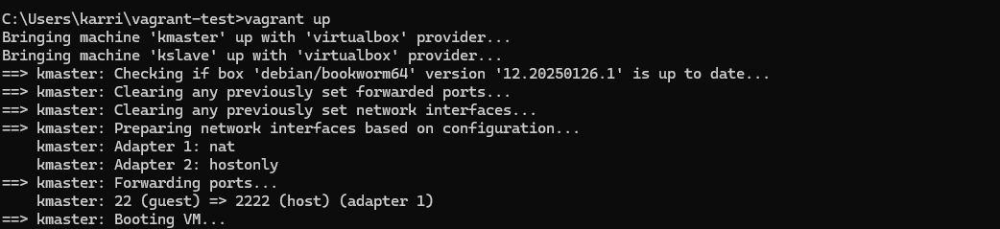  
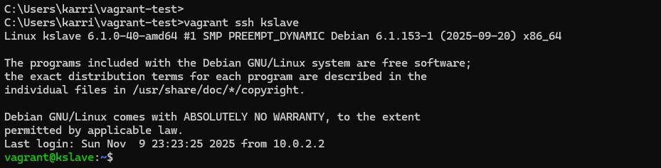
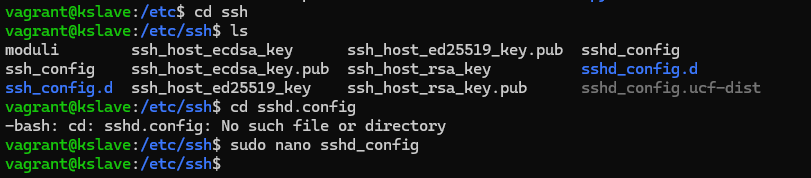  
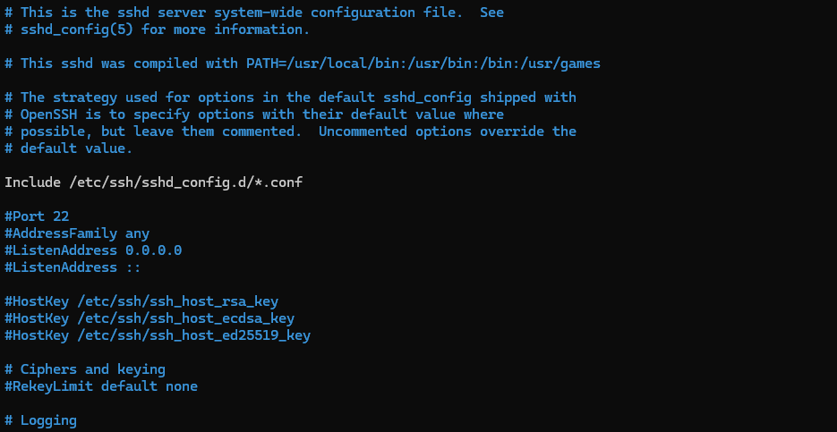  

Tiedostossa on kaikenlaista mielenkiintoista. En rupea mitään muuttelemaan muuta kuin sen että otan pois tuon # port 22 edestä ja lisään sinne toisen portin: port 2222.  

  

Tallennan ja suljen. Sitten aika käynnistää SSH (sudo systemctl restart ssh) uudestaan ja testaan että palvelu kuuntelee molemmissa porteissa. Mitenhän sen voi tehdä? Googletin tuon komennon, joka näkyy tehtävänannossa, nc -vz localhost 1234, ja sain vastaukseksi Netcat ohjelman, jolla pystyy lukemaan tällaista dataa. Asennetaan se. Se onkin jo valmiiksi asennettu. Potkaistaan ssh:ta ja kokeillaan sitten kuunnella. 

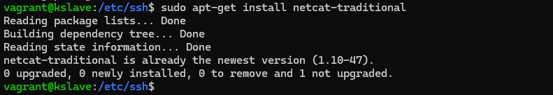  
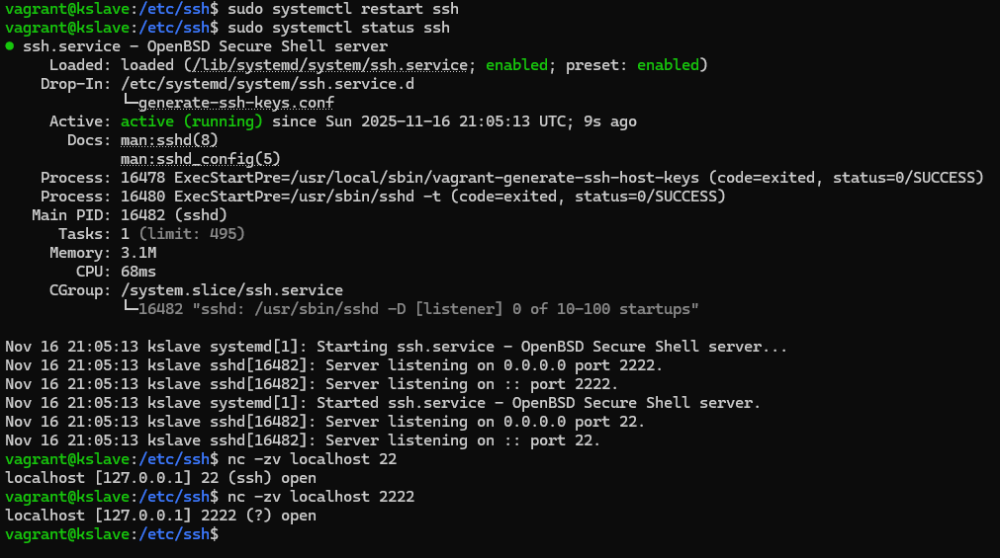  

Molemmat portit ovat auki. Näköjään se näkyi myös tuossa sudo systemctl status ssh kun tarkistelin ssh:n tilaa.  

Tehdään homma seuraavaksi Saltilla. Tehdään niin että salt asentaa SSH:n, hallitsee sshd_config ja sitten restartaa homman uudestaan. Menen maisterille tekemään se. Teen ssh-kansion saltille ja sinne init.sls -tiedoston.  

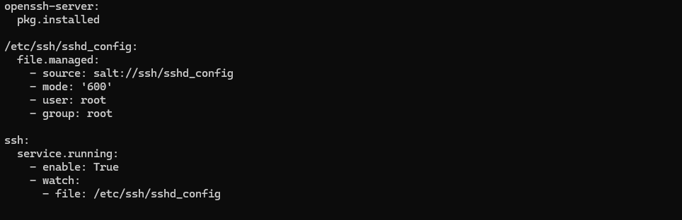  
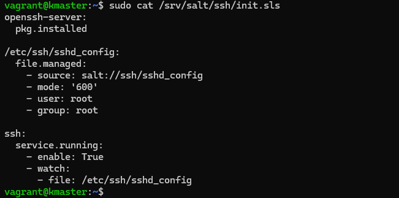  

Kopioin ssh_config tiedoston ssh-kansiosta saltiin. Sen jälkeen konfiguroidaan oikeat portit sinne. Ajetaan salt state sitten.  

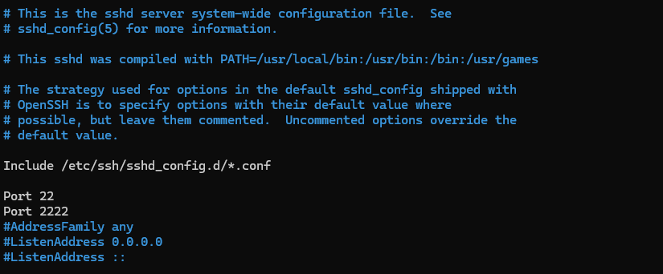  
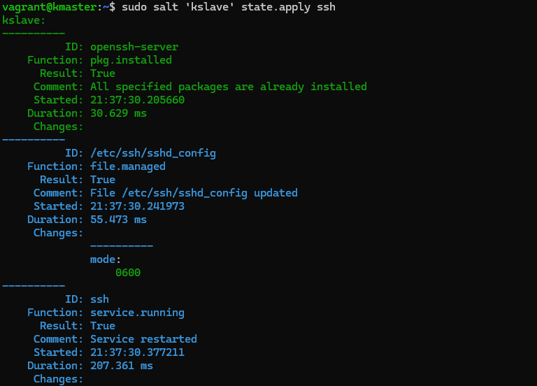  
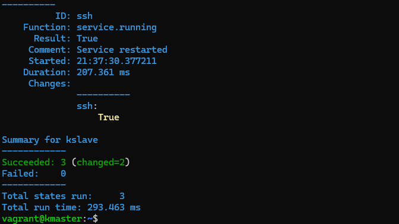  

Homma näyttäisi skulaavan.  

Teen vielä testin, jotta voi varmistua siitä, että homma on oikeasti toimiva. Rikotaan kätyrillä sshd_config tiedosto poistamalla sieltä portti 2222. Ja sitten ajetaan maisterilla salt state jälleen ja toivotaan, että se korjaa sen kätyrillä.  

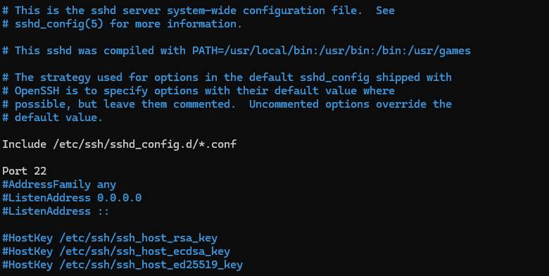  
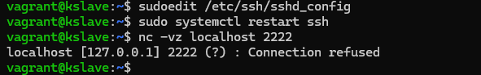  
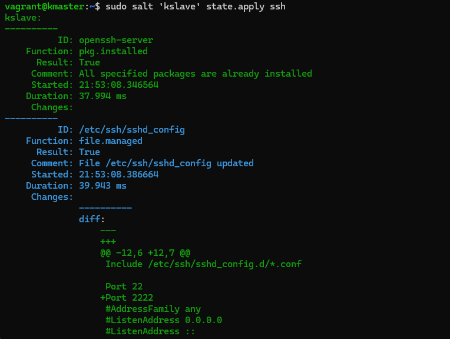  
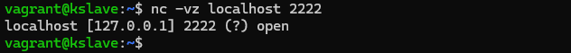  

Homma näyttäisi toimivan!

## Lähteet
- PhoenixNAP. 2022. nc Command (Netcat) with Examples. https://phoenixnap.com/kb/nc-command  
- Karvinen, Tero. 2018. Pkg-File_Service - Control Deamons with Salt - Change SSH Server Port. https://terokarvinen.com/2018/04/03/pkg-file-service-control-daemons-with-salt-change-ssh-server-port/?fromSearch=karvinen%20salt%20ssh
- HashiCorp. 2025. SSH Setting. https://developer.hashicorp.com/vagrant/docs/vagrantfile/ssh_settings
- Salt Project. 2025. Salt states. https://docs.saltproject.io/salt/user-guide/en/latest/topics/states.html  
- ICompaas Support. 2025. Ensure Permissions on /etc/ssh/sshd_config Are Configurated. https://support.icompaas.com/support/solutions/articles/62000235406-ensure-permissions-on-etc-ssh-sshd-config-are-configured
