# h5 Toimiva versio

## Tehtävänanto
Tehtävät tehty [Palvelinten hallinta: h5 Toimiva versio](https://terokarvinen.com/palvelinten-hallinta/#h5-toimiva-versio) mukaan.

x) Lue ja tiivistä. (Tässä x-alakohdassa ei tarvitse tehdä testejä tietokoneella, vain lukeminen tai kuunteleminen ja tiivistelmä riittää. Tiivistämiseen riittää muutama ranskalainen viiva. Kannattaa lisätä mukaan myös jokin oma havainto, idea tai kysymys.)
- Chacon and Straub 2014: [Pro Git, 2ed: 1.3 Getting Started - What is Git?](https://git-scm.com/book/en/v2/Getting-Started-What-is-Git%3F)
- Gitin käyttö on lähinnä 'git add . && git commit; git pull && git push'. Selitä tuon komennon jokainen osa. Käytä apuna itse valitsemiasi lähteitä ja viittaa niihin.
- Varaston [terokarvinen/suolax/](https://github.com/terokarvinen/suolax/) historia, eli loki ja muutokset. Kätevimmin komentokehotteesta 'git clone https://github.com/terokarvinen/suolax.git; cd suolax/; git log --patch --color|less -R'. Wepistäkin saattaa onnistua kliksuttelemalla "[Commits](https://github.com/terokarvinen/suolax/commits/main/)".  

a) Online. Tee uusi varasto GitHubiin (tai Gitlabiin tai mihin vain vastaavaan palveluun). Varaston nimessä ja lyhyessä kuvauksessa tulee olla sana "snow". Aiemmin tehty varasto ei kelpaa. (Muista tehdä varastoon tiedostoja luomisvaiheessa, esim README.md ja GNU General Public License 3)  

b) Dolly. Kloonaa edellisessä kohdassa tehty uusi varasto itsellesi, tee muutoksia omalla koneella, puske ne palvelimelle, ja näytä, että ne ilmestyvät weppiliittymään.  

c) Doh! Tee tyhmä muutos gittiin, älä tee commit:tia. Tuhoa huonot muutokset ‘git reset --hard’. Huomaa, että tässä toiminnossa ei ole peruutusnappia.  

d) Tukki. Tarkastele ja selitä varastosi lokia. Tarkista, että nimesi ja sähköpostiosoitteesi näkyy haluamallasi tavalla ja korjaa tarvittaessa.  

e) Suolattu rakki. Aja Salt-tiloja omasta varastostasi. (Salt tiedostot mistä vain hakemistosta "--file-root teronSaltHakemisto". Esimerkiksi 'sudo salt-call --local --file-root srv/salt/ state.apply', huomaa suhteellinen polku.)  

## Pro Git, 2nd: 1.3 Getting Started - What is Git?
- Git on versionhallintajärjestelmä, joka seuraa muutoksia tiedostoissa ja mahdollistaa usean ihmisen työskentelyn samassa projektissa.
- Git tallentaa tiedot snappshotteina.
- Se toimii pääasiassa paikallisesti, mikä tekee siitä nopean verrattuna keskitettyihin järjestelmiin.
- Gitissä on kolme pääaluetta:
  - Working directory
  - Staging area
  - Repository

## Git add . && git commit && git pull && git push
- Git add . - Lisää kaikki muuttuneet ja uudet tiedostot staging-alueelle.
- Git commit - Luo uuden commitin staging-alueen muutoksista ja avaa oletustekstieditorin commit-viestin kirjoitusta varten.
- Git pull - Hakee tuoreimmat muutokset ulkoiselta repolta ja yhdistää ne paikalliseen versioon.
- Git push - Lähettää omat commitit ulkoiseen repoon (esim. Github)

Lähteet: https://www.atlassian.com/git/tutorials/atlassian-git-cheatsheet ja https://www.geeksforgeeks.org/git/git-cheat-sheet/

## terokarvinen/suolax
- Alkuperäinen commit: varasto luotiin ja mukana LICENSE-tiedosto ja README.md.
- Luodaan ensimmäinen toiminnallisuus kun luodaan "hello world" -moduuli.
- Lisätty Makefile, jolla ajetaan salt-tiloja. Hello tila tehty tänne.
- Favorites tila, joka asentaa ohjelmia tehty.
- Parannettiin README.md -tiedostoa.
- Lisättiin suosikkiohjelmat Favourites-pakettiin ja ne määriteltiin Salt-tilassa.
- Parannellaan README-tiedostoa ja Makefileä päivitettiin.
- README-tiedosto saa lisää tarkempia ohjeita.

## a) Online

Menen githubiini, siellä välilehdelle repositories ja luon uuden repon. Annan sille nimeksi snow-flake ja lisään README.md -tiedoston ja lisensoin GNU General Public License 3. Sitten painan 'create repository' -nappia. Ja näin uusi repo on luotu.

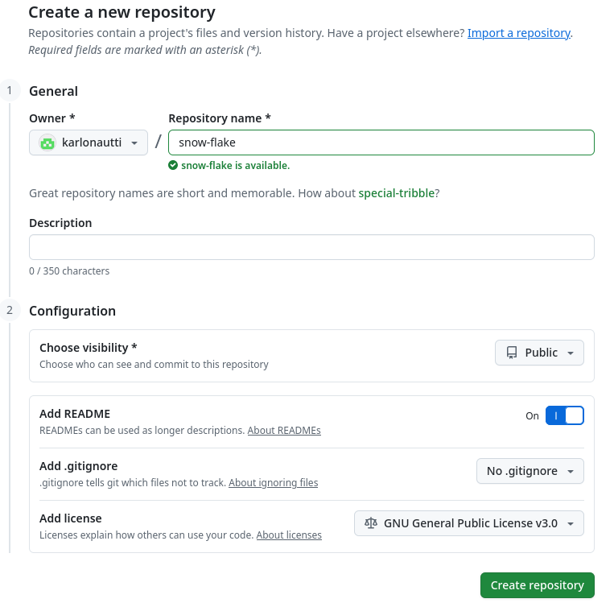  
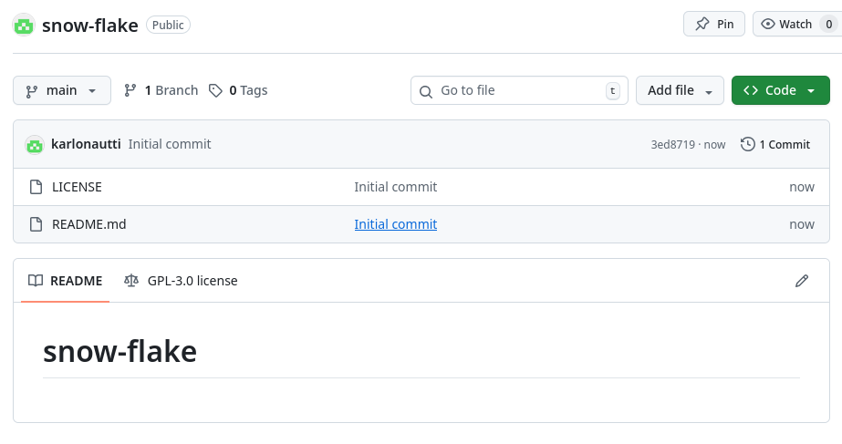  

## b) Dolly

Kloonaan tekemäni repon. Käytän SSH-osoitetta. Olen jo aikaisemmin luonut SSH-avaimen ja laittanut sen Githubiin, joten en luo sitä nyt. Mutta se onnistuu komennolla ssh-keygen ja sitten luodusta kansiosta etsitään .pub-tiedosto ja cat-komennolla luetaan se ja liitetään githubiin settingseihin ssh-avain paikkaan.  

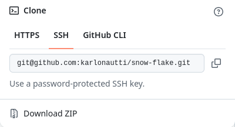  

Menen kansioon komennolla 'cd snow-flake' ja luon sinne testitiedoston helposti käyttämällä echo-komentoa. Tarkistetaan vielä kansiossa 'ls' että tiedosto on luotu ja luetaan se 'cat test.md'. Homma mennyt niin kuin pitääkin.  

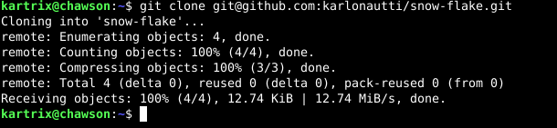  

Sitten lisätään se gitiin. Ensiksi git add . valmistaa uuden tiedoston lisättäväksi, git commit avaa tekstieditorin ja voin laittaa commit-viestin. Tässä vaiheessa en tee git pull, koska repoon ei ole vielä lisätty mitään uutta, joten vain git push lisää tiedoston repoon.  

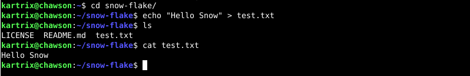  
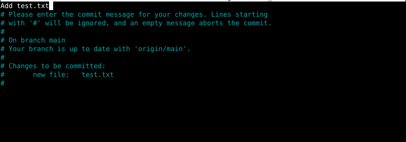  
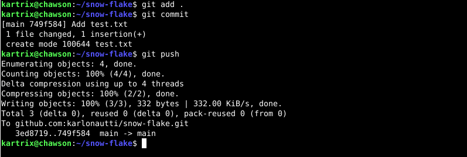  

Tarkastellaan miltä repo näyttää wepissa. Tiedosto meni repoon ja kaikki näyttää hyvältä.  

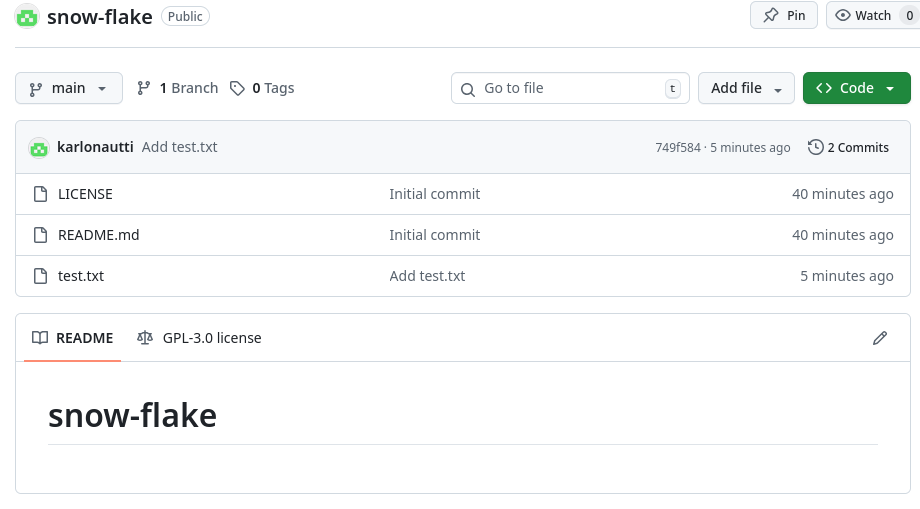  
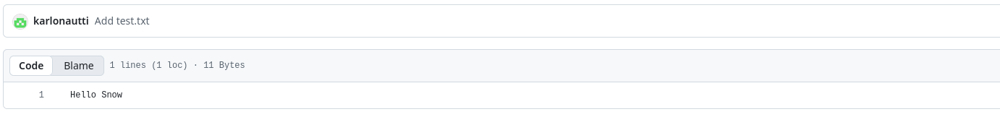  

## c) Doh!

Tehdään tyhmä muutos gitiin. 'echo "This is a stupid mistake" > test.txt'. Tämä ylikirjoittaa tekstitiedostosta olevan tekstin. Sitten varmistetaan muutos cat-komennolla. Muutos tapahtunut. Perutaan muutos 'git reset --hard'. Koska en ole tehnyt vielä commitia tälle uudelle muutokselle niin git reset -komennolla palataan edelliseen committiin.  

  

## d) Tukki

Luetaan lokia. 'git log --patch --color|less -R' 

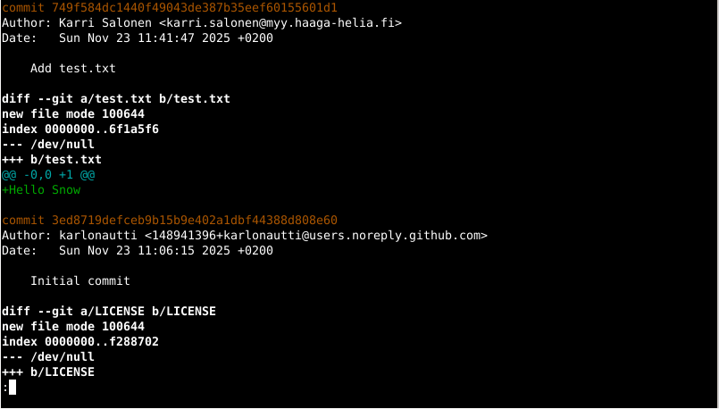  
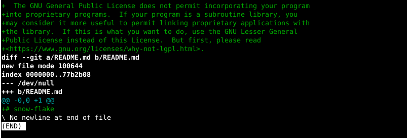  

Eipä tässä ole mielestäni mitään erikoista. Initial committissa, eli ensimmäisen commit, repo luodaan ja sen teki karlonautti ja hänellä näkyy sähköpostina Githubin noreply-sähköposti. Näkyy myös milloin tämä repo on luotu. Ensimmäisellä kerralla on myös lisätty License -tiedosto sekä README.md, joka on muuten tyhjä paitsi että siellä on otsikkona repon nimi.  

Toisena commitina luotu test.txt -tiedosto. Sen tein minä ja näkyy koulun sähköposti ja milloin tämä commit on tehty. Test.txt. -tiedoston sisältö on 'Hello Snow'.

## e) Suolattu rakki

Luon snow-flake -kansioon salt-kansion. Teen top.sls -tiedoston ja package-kansion. Package-kansioon luon init.sls -tiedoston, mihin laitan 3 ohjelmaa, jotka Salt sitten asentaa koneelle. Ohjelmat ovat htop, tree ja ninvaders-peli. Sitten top.sls -tiedostoon base ja sen alle packages niin salt ajaa sitten tämän packages tilan kaikille orjille. Ajetaan kuitenkin homma lokaalisti komennolla 'sudo salt-call --local --file-root salt state.apply'.  

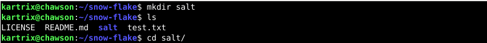  
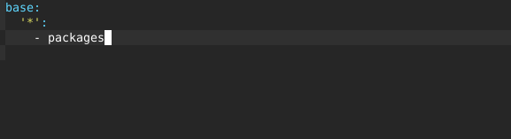  
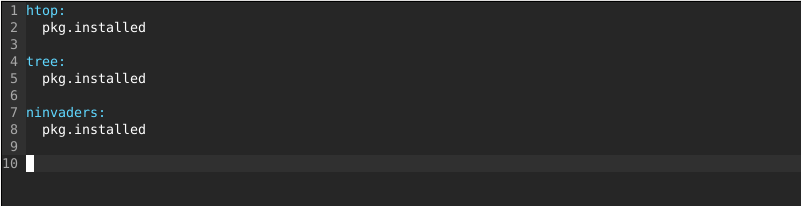  
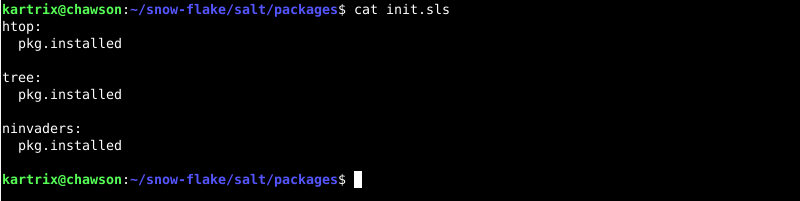  
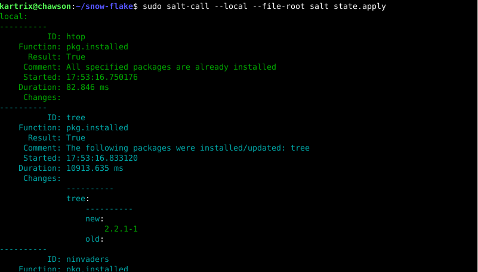  
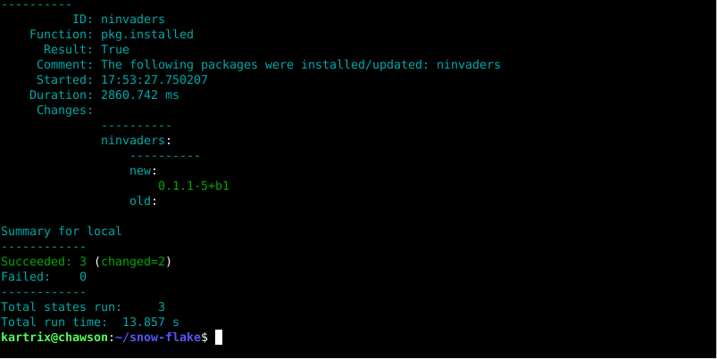  

Salt ajoi tilan ja asensi 2 ohjelmaa ja näyttää että htop oli jo asennettu. Homma skulaa.

## Lähteet:

Atlassian. 2025. Git cheat sheet. https://www.atlassian.com/git/tutorials/atlassian-git-cheatsheet  
Chacon & Straub. 2014. 1.3 Getting Startes - What is Git?. https://git-scm.com/book/en/v2/Getting-Started-What-is-Git%3F  
Geeks for geeks. 2025. Git Cheat Sheet. https://www.geeksforgeeks.org/git/git-cheat-sheet/  
Karvinen, Tero. 2025. Palvelinten Hallinta. https://terokarvinen.com/palvelinten-hallinta/#h5-toimiva-versio  
Tero Karvisen Github-repository. https://github.com/terokarvinen/suolax/  
